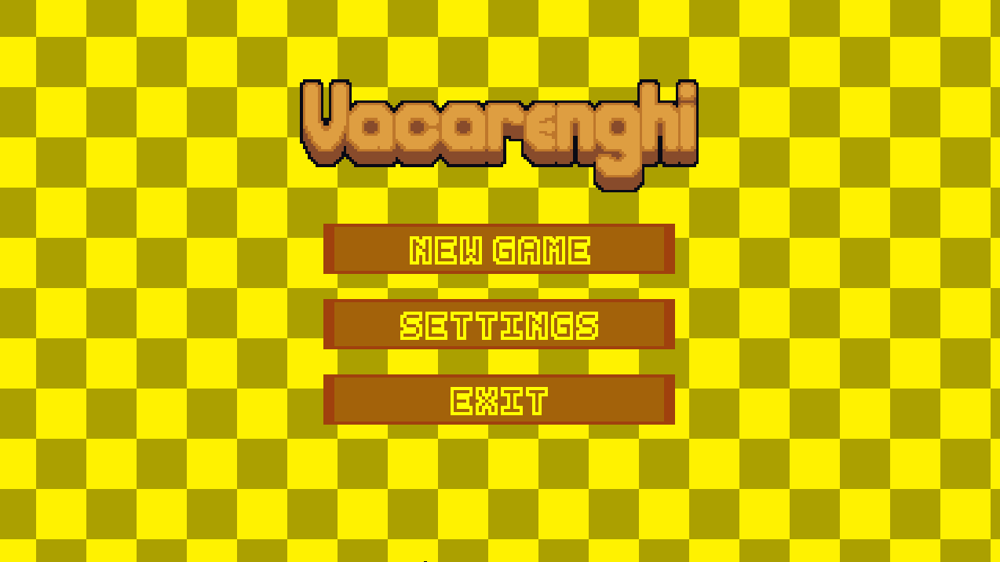

# VALCARENGHI TOP-DOWN TEMPLATE GAME
Este é um projeto de desenvolvido em GameMaker para 
explorar mecânicas fundamentais de jogos. 

Consiste em um template modular criado para acelerar o
desenvolvimento de jogos 2D(top-down). Este projeto foi 
estruturado para ser uma base limpa, permitindo que você 
foque na criação dos seus assets e níveis, sem se preocupar 
com os sistemas básicos.

## Funcionalidades Principais
- Menu e interface
- Opções de tela (resolução/janela)
- Alternância de idioma
- Movimentação fluida
- Sistema de tiro
- Coleta de itens
- Inimigos perseguidores
- Efeitos especiais para itens coletáveis

## Futuras implementações
- Música e efeitos sonoros
- Diferentes inimigos

## Como usar este template
1. **Clone o repositório:**
   `git clone https://github.com/seu-usuario/seu-repositorio.git`
2. **Abra no GameMaker:** Importe o projeto e comece a substituir os objetos e sprites pelos seus.
3. **Customize:** Explore os scripts para ajustar do seu jeito.

## Contribuições
Este template é **open source**. Sinta-se à vontade para 
realizar um *Fork* e adaptar para as suas necessidades. 
Se encontrar formas de otimizar os sistemas, contribua com um 
*Pull Request*!

## Autor
Valcarenghi
